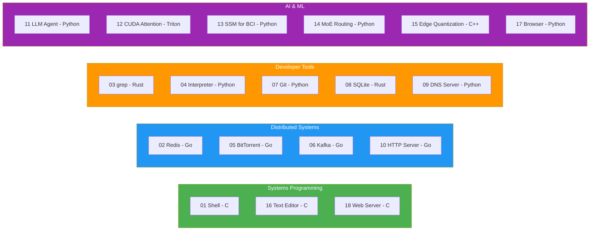
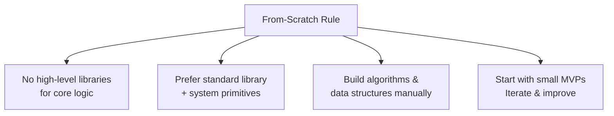

# zero-abstraction-build-it-all 🔨⚙️

[](https://github.com/krishnakumarbhat/zero-abstraction-build-it-all/actions/workflows/ci.yml)
[](LICENSE)

A **"build your own X" workspace** with 18 projects — from shells and databases to CUDA kernels and LLM agents. Implemented from scratch in **Python, Go, C, C++, and Rust** with a strict no-library, build-it-yourself philosophy.

## 🏗️ Project Map



## 📋 Full Project List

| #   | Project                                                 | Language      | Category    |
| --- | ------------------------------------------------------- | ------------- | ----------- |
| 01  | [Shell](projects/01-shell-c/)                           | C             | Systems     |
| 02  | [Redis](projects/02-redis-go/)                          | Go            | Distributed |
| 03  | [grep](projects/03-grep-rust/)                          | Rust          | Dev Tools   |
| 04  | [Interpreter](projects/04-interpreter-python/)          | Python        | Dev Tools   |
| 05  | [BitTorrent](projects/05-bittorrent-go/)                | Go            | Distributed |
| 06  | [Kafka](projects/06-kafka-go/)                          | Go            | Distributed |
| 07  | [Git](projects/07-git-python/)                          | Python        | Dev Tools   |
| 08  | [SQLite](projects/08-sqlite-rust/)                      | Rust          | Dev Tools   |
| 09  | [DNS Server](projects/09-dns-python/)                   | Python        | Dev Tools   |
| 10  | [HTTP Server](projects/10-http-go/)                     | Go            | Distributed |
| 11  | [LLM Agent](projects/11-agent-python/)                  | Python        | AI/ML       |
| 12  | [CUDA Attention](projects/12-attention-triton/)         | Triton/Python | AI/ML       |
| 13  | [Distributed SSM](projects/13-distributed-ssm-bci/)     | Python        | AI/ML       |
| 14  | [MoE Routing](projects/14-moe-routing-paper/)           | Python        | AI/ML       |
| 15  | [Edge Quantization](projects/15-edge-quantization-cpp/) | C++           | AI/ML       |
| 16  | [Text Editor](projects/16-text-editor-c/)               | C             | Systems     |
| 17  | [Browser](projects/17-browser-python/)                  | Python        | AI/ML       |
| 18  | [Web Server](projects/18-web-server-c/)                 | C             | Systems     |

## 🧠 Design Philosophy



> **The From-Scratch Rule:** Avoid high-level libraries/frameworks that implement the core logic for you. Prefer standard library + system primitives. Build core algorithms and data structures manually.

## 🚀 Quick Start

Each project contains its own `README.md` with build/run steps.

### Suggested Order

1. Shell (C) → 2. Redis (Go) → 3. grep (Rust) → 4. Interpreter (Python) →
2. BitTorrent (Go) → 6. Kafka (Go) → 7. Git (Python) → 8. SQLite (Rust) →
3. DNS (Python) → 10. HTTP (Go) → 11. LLM Agent (Python) →
   12–15. Advanced AI/ML projects → 16–18. More systems

### Example: Build the Shell

```bash
cd projects/01-shell-c
gcc -o shell main.c
./shell
```

### Example: Build grep

```bash
cd projects/03-grep-rust
cargo build --release
./target/release/grep-rust "pattern" file.txt
```

## 📁 Project Structure

```
zero-abstraction-build-it-all/
├── projects/
│   ├── 01-shell-c/
│   ├── 02-redis-go/
│   ├── 03-grep-rust/
│   ├── 04-interpreter-python/
│   ├── 05-bittorrent-go/
│   ├── 06-kafka-go/
│   ├── 07-git-python/
│   ├── 08-sqlite-rust/
│   ├── 09-dns-python/
│   ├── 10-http-go/
│   ├── 11-agent-python/
│   ├── 12-attention-triton/
│   ├── 13-distributed-ssm-bci/
│   ├── 14-moe-routing-paper/
│   ├── 15-edge-quantization-cpp/
│   ├── 16-text-editor-c/
│   ├── 17-browser-python/
│   ├── 18-web-server-c/
│   ├── scratch/                 # Experimental code
│   └── FROM_SCRATCH_ROADMAP.md  # Extended roadmap
├── .github/workflows/           # Multi-language CI/CD
├── .gitignore
├── LICENSE
└── README.md
```

## 📝 License

MIT License — see [LICENSE](LICENSE)

## 🤝 Contributing

1. Fork the repository
2. Create a feature branch: `git checkout -b feature-name`
3. Commit your changes: `git commit -m 'Add feature'`
4. Push to the branch: `git push origin feature-name`
5. Open a pull request
